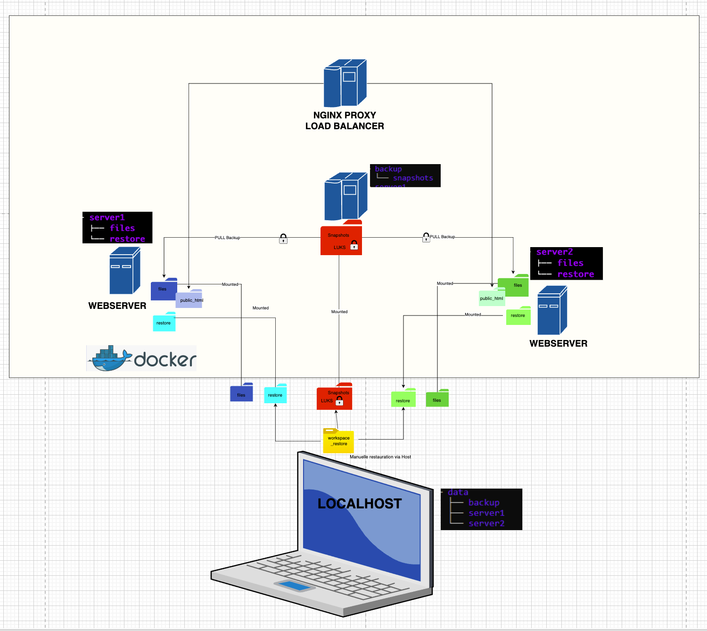

---

# Automated Resilient Web Infrastructure with Secure Backups

*(Nginx Reverse Proxy + TLS + Rsnapshot + LUKS)*

This repository implements a **secure and resilient web infrastructure** combining:

* **Nginx reverse proxy with load balancing**
* **TLS encrypted access**
* **Two backend application servers**
* **A secure backup server**
* **LUKS encrypted storage with rsnapshot deduplication**

The project demonstrates how to design a **secure multi-service architecture** where:

* client traffic is protected by **TLS**
* backend servers are protected behind a **reverse proxy**
* data is preserved using **rsnapshot**
* backup storage is secured using **LUKS disk encryption**

---

# Infrastructure Architecture



The infrastructure simulates a **real production environment** composed of multiple services.

```text
             client
                │  
            HTTPS (TLS)
                │
        Nginx Reverse Proxy
        (load balancing)
                 │
 ┌───────────────┴───────────────┐
 │                               │
server1                       server2
(web application)             (web application)
 │                               │
 └───────────────┬───────────────┘
                 │
           backup server
                 │
             rsnapshot
                 │
        LUKS encrypted disk
```

---

# Reverse Proxy & Load Balancing

The **Nginx proxy** acts as the single entry point of the infrastructure.

Responsibilities:

* TLS termination
* request routing
* load balancing between backend servers

Load balancing algorithm used:

```
round robin
```

The proxy exposes:

```
HTTPS → port 443
```

Docker port mapping:

```
443 (host) → 8080 (nginx container)
```

---

# Backend Web Servers

Two backend servers are deployed:

```
server1
server2
```

Each server hosts application data and a small web site.

Example structure:

```
files/
├── business
│   ├── clients.txt
│   └── orders.txt
├── config
│   └── app.conf
└── public_html
    └── index.html
```

The backend servers **do not accept direct external connections**.

Only the proxy container is allowed to access them.

Example restriction:

```
allow proxy-ip
deny all
```

---

# TLS Encryption

All client connections are encrypted using **TLS**.

Certificates are automatically generated using **self-signed certificates**.

For testing purposes:

```bash
curl -k https://localhost
```

The `-k` option is required because the certificate is not signed by a trusted CA.

---

# Secure Backup System

The infrastructure includes a **dedicated backup container** using:

* rsnapshot
* rsync
* SSH

The backup server operates in **pull mode**:

```
backup → server1
backup → server2
```

Snapshots are stored in:

```
/snapshots
```

Example:

```
alpha.0
alpha.1
```

---

# LUKS Encrypted Backup Storage

Backup data is stored on a **LUKS encrypted disk image**.

This provides:

* **AES-256 disk encryption**
* protection of data at rest
* compatibility with rsnapshot hardlink deduplication

Device used by the system:

```
/dev/mapper/backup_disk
```

The encrypted disk is mounted to:

```
./data/backup
```

---

# The Challenge: Encryption vs Deduplication

When encryption is applied at the **file level** (e.g. GPG), each encrypted file produces high-entropy data, preventing deduplication.

Our solution:

* **LUKS disk encryption**
* rsnapshot stores **raw files**
* filesystem **hardlinks reuse identical data**

Result:

```
Security + efficient disk usage
```

---

# Installation

## Install Cryptsetup

```bash
sudo apt update
sudo apt install cryptsetup -y
```

---

## Create and Format Encrypted Disk

```bash
truncate -s 500M encrypted_disk.img

sudo cryptsetup luksFormat encrypted_disk.img

sudo cryptsetup luksOpen encrypted_disk.img backup_disk

sudo mkfs.ext4 /dev/mapper/backup_disk
```

---

# Mount Encrypted Backup Volume

Before starting the infrastructure:

```bash
sudo cryptsetup luksOpen encrypted_disk.img backup_disk
sudo mount /dev/mapper/backup_disk ./data/backup
```

---

# Start Infrastructure

```bash
docker compose up -d --build
```

---

# Verification

Check running containers:

```bash
docker ps
```

Test HTTPS access:

```bash
curl -k https://localhost
```

You should see responses alternating between the backend servers.

---

# Hardlink Deduplication Proof

Run two backup cycles:

```bash
docker exec -it backup rsnapshot alpha
docker exec -it backup rsnapshot alpha
```

Check inode numbers:

```bash
docker exec -it backup ls -li \
/snapshots/alpha.0/server1/server1files/files/hellosrv1.txt \
/snapshots/alpha.1/server1/server1files/files/hellosrv1.txt
```

If the inode numbers are identical, deduplication is working correctly.

---

# Restore Procedure

Example restore from snapshot:

```bash
cp ../data/backup/snapshots/alpha.1/server1/server1files/files/hellosrv1.txt .
```

Reinject the file into the server:

```bash
cp hellosrv1.txt ../data/server1/restore/
```

Verify inside the container:

```bash
docker exec -it server1 ls -l /server1files/restore/
```

---

# Close Encrypted Vault

To ensure encryption at rest:

```bash
docker compose down
sudo umount ./data/backup
sudo cryptsetup luksClose backup_disk
```

---

# Technology Stack

* Docker
* Docker Compose
* Nginx
* Rsnapshot
* Rsync / SSH
* TLS
* LUKS disk encryption

---
